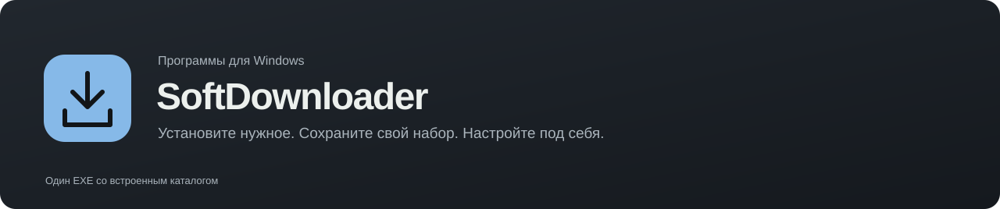
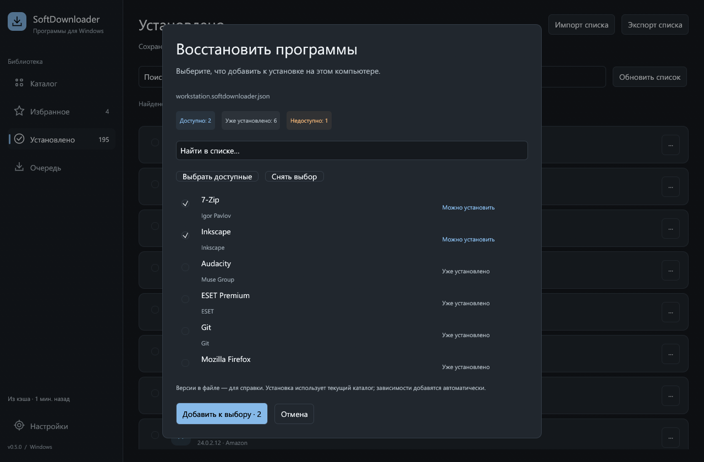
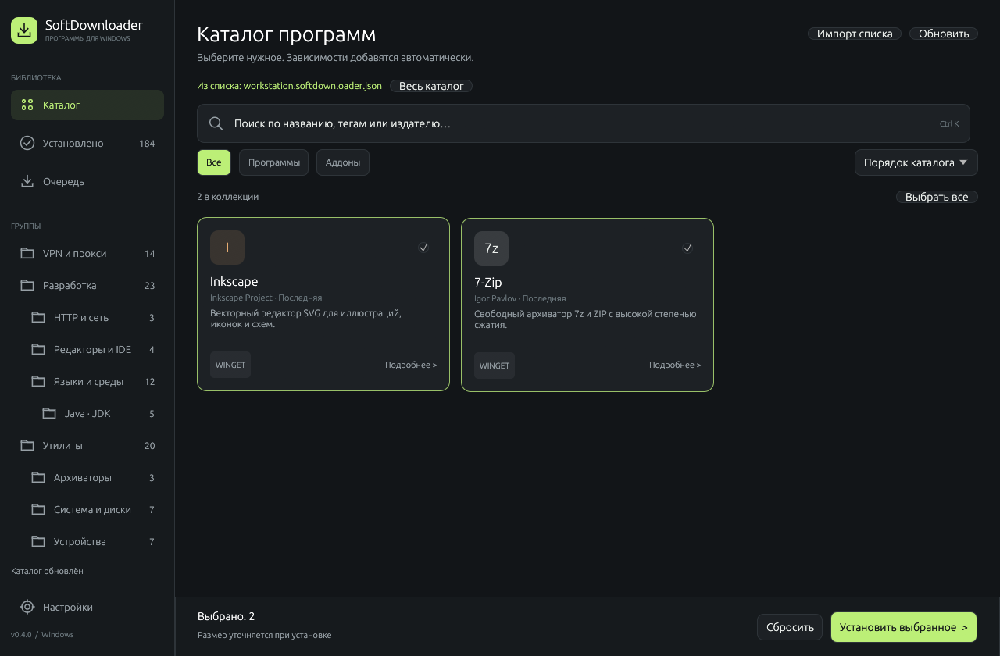
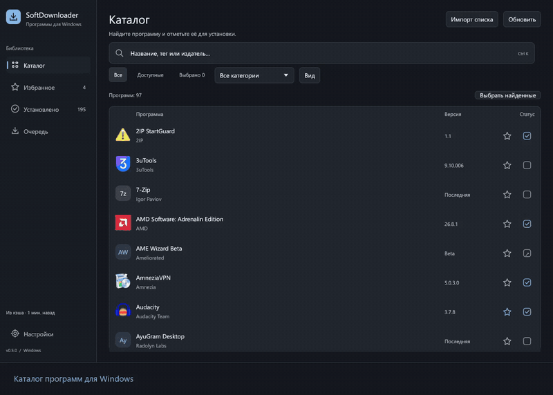
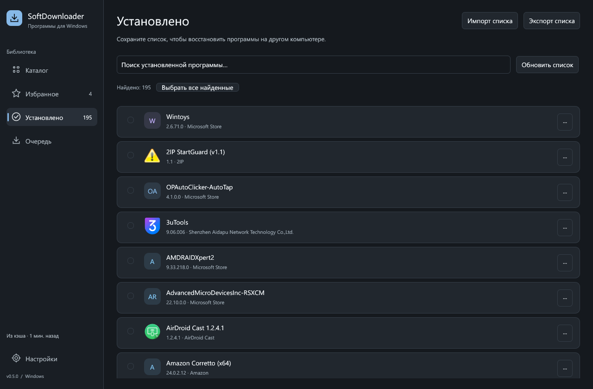
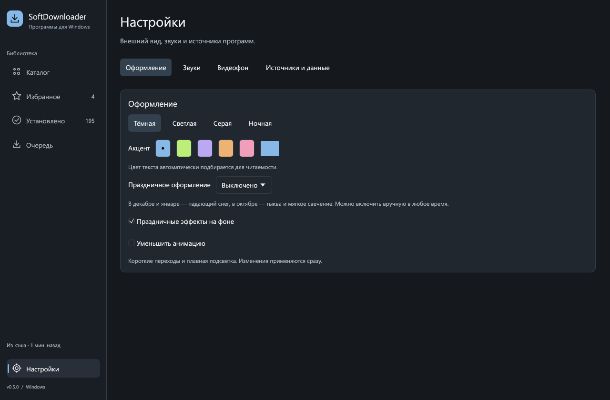

<p align="center">
  
</p>

<p align="center">
  <a href="https://github.com/HVHBIGNAME/SoftDownloader/releases/latest"></a>
  <a href="https://github.com/HVHBIGNAME/SoftDownloader/actions/workflows/windows.yml"></a>
  
  <a href="LICENSE"></a>
</p>

**Нативный менеджер программ для Windows на Rust + egui — один EXE.** Скачайте и запустите: каталог, иконки и интерфейс уже внутри. Выберите софт, проверьте план и установите нужное одной очередью. Сохранённый список поможет собрать такое же рабочее окружение на другом ПК.

<p align="center">
  <a href="https://github.com/HVHBIGNAME/SoftDownloader/releases/latest/download/SoftDownloader.exe"><b>Скачать SoftDownloader.exe</b></a> ·
  <a href="#перенос-списка-программ">Перенос программ</a> ·
  <a href="#видео-использования">Видео</a> ·
  <a href="docs/verification.md">Проверки</a>
</p>


## Начать работу

1. Скачайте **[SoftDownloader.exe](https://github.com/HVHBIGNAME/SoftDownloader/releases/latest/download/SoftDownloader.exe)** и запустите его.
2. Дождитесь проверки установленного ПО. Найдите программы через поиск или группы и отметьте нужные.
3. Нажмите **«Установить выбранное»**, проверьте зависимости и подтвердите установку. Результаты появятся в очереди.

Для пакетов WinGet нужен [Установщик приложений Microsoft](https://apps.microsoft.com/detail/9nblggh4nns1). EXE/MSI при необходимости откроют штатный мастер или запрос UAC.

Само приложение поставляется одним файлом, работает с системными библиотеками Windows и хранит настройки/кэш в AppData. Установка Rust, Python или отдельного runtime для его запуска не требуется. Файл `.sha256` в релизе — необязательная проверка скачивания; видео и документация доступны отдельно.

## Перенос списка программ

**На текущем ПК:** `Установлено → Экспорт списка` → сохраните JSON-файл.

**На новом ПК:** `Импорт списка` или **Ctrl+O** → выберите файл → проверьте найденные программы → **«Добавить к выбору»** → **«Установить выбранное»**.

- В экспорт попадает полный обнаруженный список, включая программы вне каталога.
- Доступные отсутствующие программы отмечаются в предпросмотре; выбор можно изменить.
- Уже установленные пропускаются. Неизвестные и недоступные записи видны с пояснением.
- Используются рецепты текущего каталога. Сохранённые версии служат справкой; зависимости добавляются автоматически.

**[Подробности и формат списка](docs/program-lists.md)** · **[Пример JSON](docs/examples/workstation.softdownloader.json)**

| Предпросмотр импорта | Выбор перед установкой |
|---|---|
|  |  |

## Видео использования

[](https://github.com/HVHBIGNAME/SoftDownloader/releases/download/v0.4.0/SoftDownloader-0.4.0-demo.mp4)

**[Открыть / скачать полное видео MP4 · 30 секунд](https://github.com/HVHBIGNAME/SoftDownloader/releases/download/v0.4.0/SoftDownloader-0.4.0-demo.mp4)** — запись настоящего окна: группы, настройки, экспорт, импорт примера, выбор и подтверждение плана. Запись заканчивается перед запуском установщиков.

## Возможности

| | |
|---|---|
| **Один файл** | `SoftDownloader.exe` со встроенными каталогом, шрифтами и иконками. Сборка оптимизирована по размеру: full LTO, `opt-level=z`, статический CRT. |
| **97 пакетов · 22 группы** | Браузеры, общение, разработка, ИИ, VPN, медиа, игры и системные утилиты. |
| **Одна очередь** | WinGet, Microsoft Store, EXE/MSI, ZIP, portable EXE и расширения VS Code. Повтор незавершённых задач и отмена загрузок. |
| **Учёт установленного** | Реестр Windows, Store, WinGet, VS Code, известные папки и PATH. Удаление по одной программе или списком. |
| **Компактный интерфейс** | Тёмная тема, мягкая подсветка, короткие переходы, виртуализированные списки. Уведомления не сдвигают содержимое. Анимацию можно уменьшить. |
| **Локальные иконки** | Извлечение из установленных программ в фоне, кэш удачных и неудачных чтений. Для остальных — цветные плитки. |
| **Кэш и таймауты** | Каталог сохраняется на час. Явное обновление обходит кэш; успешные ответы сохраняются даже при таймауте других источников. |
| **Проверка файлов** | SHA-256 из каталога/GitHub; для официального сайта без опубликованного хеша — Authenticode средствами Windows. |

<details>
<summary><b>Что есть в каталоге</b></summary>

| Группа | Примеры |
|---|---|
| Общение и браузеры | Discord, Telegram, AyuGram, Thunderbird, Brave, Chrome, Firefox |
| ИИ | Cursor, Trae, Antigravity, Claude Desktop, Claude Code/CLI, Cline, Hermes |
| Разработка | VS Code, Visual Studio Community 2026, Sublime Text, Notepad++, Git, Docker, DB Browser |
| Языки и среды | Python 3.13/3.14, Node.js LTS, Go, Rust, Visual C++ x64/x86, Temurin JDK 8/11/17/21/25 |
| VPN и сеть | Amnezia, FlClash, Happ, Proton, Mullvad, Windscribe, WireGuard, WARP, Hiddify, Tailscale, Proxifier, TgWsProxy, zapret |
| Медиа и творчество | Spotify, VLC, OBS, Audacity, Blender, GIMP, Inkscape, CapCut, DroidCam |
| Игры и устройства | Steam, WeMod, LabyMod, Modrinth, Prism, LiquidLauncher, Minecraft, Meta Horizon Link, Sideloadly, 3uTools, iTunes |
| Утилиты | WinRAR, Bandizip, 7-Zip, CrystalDiskInfo/Mark, System Informer, ShareX, Twinkle Tray, Wireshark, OP Auto Clicker, таймеры выключения |

81 пакет использует WinGet: 80 из `winget`, один из `msstore`. Ещё 9 — прямые загрузки, Cline — Marketplace. У шести ручных карточек есть ссылка и инструкция: Hermes, AME Wizard Beta, AMD Software, NVIDIA App, ESET Premium и 2IP StartGuard.

Полные записи и правила обнаружения: [`catalog/extended.json`](catalog/extended.json). Claude Code и Claude CLI объединены; System Informer — продолжение Process Hacker. TgWsProxy и zapret требуют настройки после распаковки. Подробности установки и удаления — в [документации](docs/catalog.md).

</details>

| Установленные программы | Настройки |
|---|---|
|  |  |

## Google Диск — для дополнительного софта

Основной каталог получает программы из WinGet, GitHub и с сайтов разработчиков. **Google Диск предназначен для дополнительных пакетов, которые будут добавлены позже.** Адрес этой коллекции встраивается в приложение; обычному пользователю не нужно подключать свой Диск.

В `0.4.0` канал дополнений подготовлен, публичный каталог ещё не задан. Его адрес задаётся владельцем сборки в [`catalog/channel.json`](catalog/channel.json) или через `SOFTDOWNLOADER_CATALOG_URL` при сборке. Дополнения объединяются с основным каталогом, а стабильные ID сохраняют совместимость экспортированных списков.

Настройка собственного источника находится в свёрнутом разделе настроек для владельца коллекции. **[Подготовка и публикация дополнений](docs/google-drive.md)** · **[Формат каталога](docs/catalog.md)**

## Сборка и проверки

Нужны Rust **1.88+**, MSVC toolchain и Visual Studio Build Tools с компонентом Desktop development with C++.

```powershell
cargo run --release

cargo fmt --all -- --check
cargo clippy --all-targets --all-features --locked -- -D warnings
cargo test --all-targets --all-features --locked
python -m unittest discover -s tools/tests -v

cargo build --release --locked
powershell -ExecutionPolicy Bypass -File tools/package.ps1
python tools/verify_standalone.py --file dist/SoftDownloader.exe
```

Отдельный профиль: `SoftDownloader.exe --data-dir "C:\Temp\SoftDownloader-test"`.
Локальный каталог дополнений: `SoftDownloader.exe --catalog "G:\Мой диск\SoftDownloader\catalog.json"`.

Обычный `cargo build --release` собирает только приложение: `target/release/softdownloader.exe`. Скрипт выпуска копирует его в `dist/SoftDownloader.exe` и записывает контрольную сумму.

Служебный CLI собирается отдельно: `cargo run --features catalog-tools --bin catalog-check -- --resolve`. Флаги `--check-winget` и `--inventory` проверяют ID и обнаружение программ. CLI предназначен разработчику и в пользовательский релиз не входит. Интеграционные тесты установки/удаления используют изолированные фиктивные пакеты. **[Результаты проверок 0.4.0](docs/verification.md)**.

Скриншоты и видео воспроизводятся через [`tools/capture_ui.py`](tools/capture_ui.py), иконка — через [`tools/make_branding.py`](tools/make_branding.py). Этим дополнительным инструментам нужен Pillow; видео также использует FFmpeg.

### Основные модули

```text
src/program_list.rs    экспорт, валидация и сопоставление списков
src/catalog_cache.rs   кэш, обновление и восстановление метаданных
src/config.rs          встроенный канал дополнений
src/catalog.rs         каталог, категории и зависимости
src/discovery.rs       GitHub Releases и официальные сайты
src/inventory.rs       обнаружение и сопоставление программ
src/engine.rs          фоновые задачи и последовательная очередь
src/ui/                интерфейс и фоновые иконки
src/system/            WinGet, Store, VS Code и Windows API
src/installer/         установщики, подписи, ZIP и portable
src/uninstall/         реестр и способы удаления
tools/catalog.py      подготовка дополнительных пакетов
```

Настройки, история, кэш и журналы хранятся локально; папка открывается из настроек. Исходный код — [MIT](LICENSE). Сторонние программы распространяются на условиях своих разработчиков.
