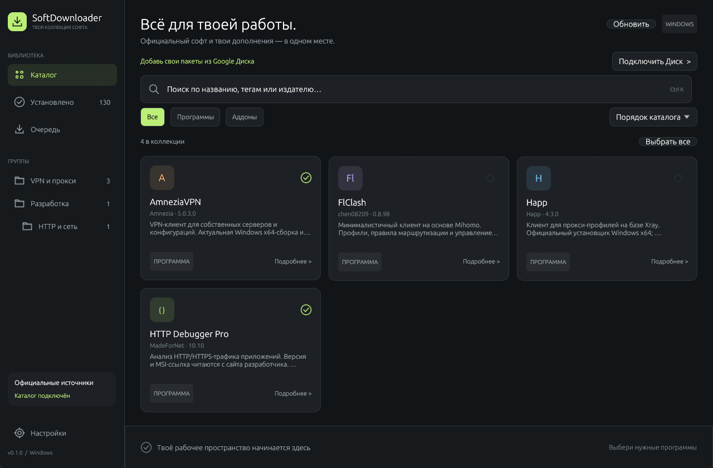

# SoftDownloader

Нативный менеджер программ для **Windows 10/11 x64** на Rust + egui. Официальные установщики с GitHub и сайтов разработчиков, свои дополнительные пакеты с Google Диска — в одном компактном интерфейсе.



## Что умеет

- **Официальный каталог:** AmneziaVPN, FlClash, Happ и HTTP Debugger Pro. Последние версии определяются при обновлении каталога.
- **Поиск, группы и подгруппы.** VPN, разработка, утилиты; группы дополняются вашим каталогом.
- **Связанные дополнения:** у программы отображаются её аддоны и дополнительные утилиты. Зависимости устанавливаются первыми.
- **Одиночная и массовая установка** EXE, MSI и ZIP-пакетов, последовательная очередь, прогресс, повтор неудачных задач.
- **Одиночное и массовое удаление:** классические Windows-программы из реестра, включая установленные другими способами, и ZIP-аддоны SoftDownloader.
- **Контроль файлов:** SHA-256 из GitHub или вашего каталога; для официального сайта без опубликованного хеша — проверка Authenticode средствами Windows.
- **Google Drive:** публичные ссылки для пользователей и локальная синхронизируемая папка для владельца коллекции.

## Запуск

Готовая сборка формируется в [GitHub Actions](https://github.com/HVHBIGNAME/SoftDownloader/actions) как артефакт `SoftDownloader-windows-x64`. После публикации тега `v*` ZIP появится также в [Releases](https://github.com/HVHBIGNAME/SoftDownloader/releases).

Распакуйте ZIP и запустите **`SoftDownloader.exe`**. Официальный каталог работает сразу. Для своих дополнений откройте **Настройки → Дополнительный каталог** и вставьте ссылку на `catalog.public.json` с Google Диска.

### Из исходников

Требуются Rust 1.88+ с MSVC toolchain и Visual Studio Build Tools с компонентом Desktop development with C++.

```powershell
cargo run --release
```

Локальная папка Google Drive или отдельный профиль:

```powershell
cargo run -- --catalog "G:\Мой диск\SoftDownloader\catalog.json"
cargo run -- --data-dir "C:\Temp\SoftDownloader-test"
```

## Свой Google Диск

Папка Google Drive for desktop синхронизирует установщики. `tools/catalog.py` подготавливает метаданные; нужен Python 3.11+, дополнительные Python-пакеты не требуются.

```powershell
$root = "G:\Мой диск\SoftDownloader"
python tools/catalog.py init --root "$root"

python tools/catalog.py add --root "$root" `
  --file "C:\Installers\MyUtility.exe" `
  --id my-utility --name "Моя утилита" --version "1.0" `
  --category utilities --silent-arg=/S
```

Для утилиты, связанной с HTTP Debugger, добавьте `--kind addon --depends-on httpdebugger --category network-tools`. Параметры тихой установки задаются по документации конкретного установщика.

Затем откройте доступ **«Все, у кого есть ссылка / Читатель»** к скопированному установщику и привяжите его ссылку:

```powershell
python tools/catalog.py link --root "$root" --id my-utility `
  --drive-url "https://drive.google.com/file/d/FILE_ID/view"
python tools/catalog.py publish --root "$root"
```

Откройте такой же доступ к `catalog.public.json`. Его ссылку пользователи вставляют в настройки приложения.

**[Полная инструкция Google Drive](docs/google-drive.md)** · **[Формат каталога и официальные источники](docs/catalog.md)**

## Установка и удаление

EXE запускается с параметрами из каталога. MSI использует `/qn /norestart`; администратор запрашивается через штатное окно UAC. Код `3010`/`1641` отображается как необходимость перезагрузки.

Удаление использует `QuietUninstallString` или тихий MSI-деинсталлятор. Если программа зарегистрировала только обычное удаление, откроется её штатный мастер — такие строки помечены **«МАСТЕР»**. Удаление из приложения запускается одной кнопкой; Windows может запросить UAC. UWP/MSIX-приложения в этот список не входят.

ZIP-аддон получает собственную управляемую папку в AppData или Documents. При обновлении заменяется только эта папка. Общая папка сторонней программы не перезаписывается. Активация плагина внутри основной программы зависит от самого приложения.

Остановка очереди отменяет скачивание и следующие задачи. Уже запущенный установщик или деинсталлятор завершает работу. Проверенные файлы с опубликованным SHA-256 остаются в кэше для повторного использования.

## Проверки и сборка

Подробности: [результаты проверок](docs/verification.md).

```powershell
cargo fmt --all -- --check
cargo clippy --all-targets --locked -- -D warnings
cargo test --all-targets --locked
python -m unittest discover -s tools/tests -v

# Проверить реальные официальные источники (нужен интернет)
cargo run --bin catalog-check -- --resolve

# Собрать переносимый ZIP
cargo build --release --bins --locked
powershell -ExecutionPolicy Bypass -File tools/package.ps1
```

Установленные программы на рабочем ПК не изменяются тестами: полный цикл установки/удаления проверяется на изолированном ZIP-пакете. Проверка источников скачивает только метаданные; `catalog-check --download-only ID --cache DIR --resolve` отдельно скачивает и проверяет установщик без запуска.

## Структура

```text
src/catalog.rs          модель каталога и зависимости
src/discovery.rs        GitHub Releases и разбор официальных страниц
src/network.rs          HTTPS и Google Drive
src/transfer.rs         загрузка, кэш и SHA-256
src/installer/         EXE/MSI, Authenticode и ZIP
src/uninstall/         реестр Windows и управляемые аддоны
src/engine.rs           фоновая очередь
src/ui/                 нативный интерфейс
catalog/builtin.json    официальный каталог
tools/catalog.py        подготовка дополнительных пакетов
```

Каталог с Google Диска дополняет встроенный. Запись с таким же `id` заменяет встроенную — так можно закрепить версию или изменить параметры установки. При распространении своей сборки можно задать `SOFTDOWNLOADER_CATALOG_URL` во время `cargo build`; ссылка станет источником дополнений по умолчанию.

Настройки, история, кэш и журналы находятся в локальной папке данных пользователя. Точный путь доступен в настройках приложения. Доступ к Google Drive выполняется по публичным ссылкам; сервисный аккаунт и ключ Google Cloud не нужны.

Лицензия кода: [MIT](LICENSE). У сторонних программ собственные лицензии и условия использования.
