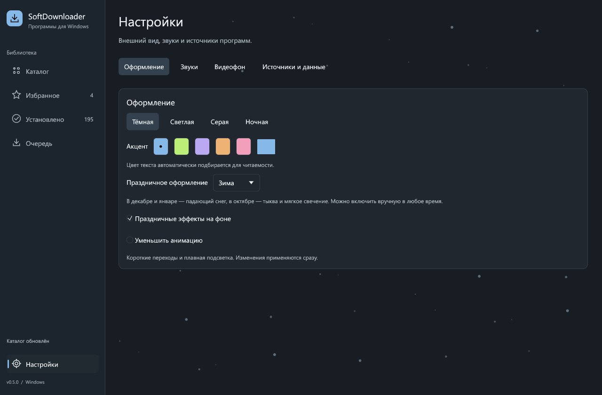
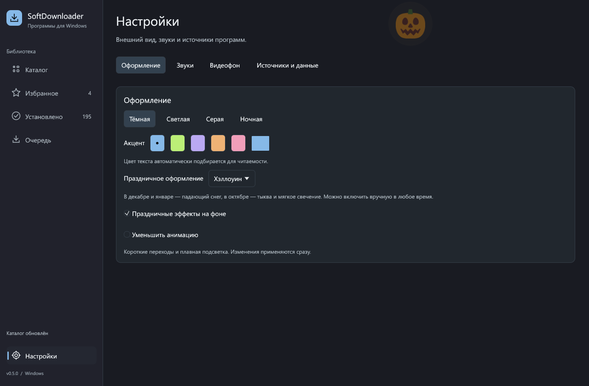
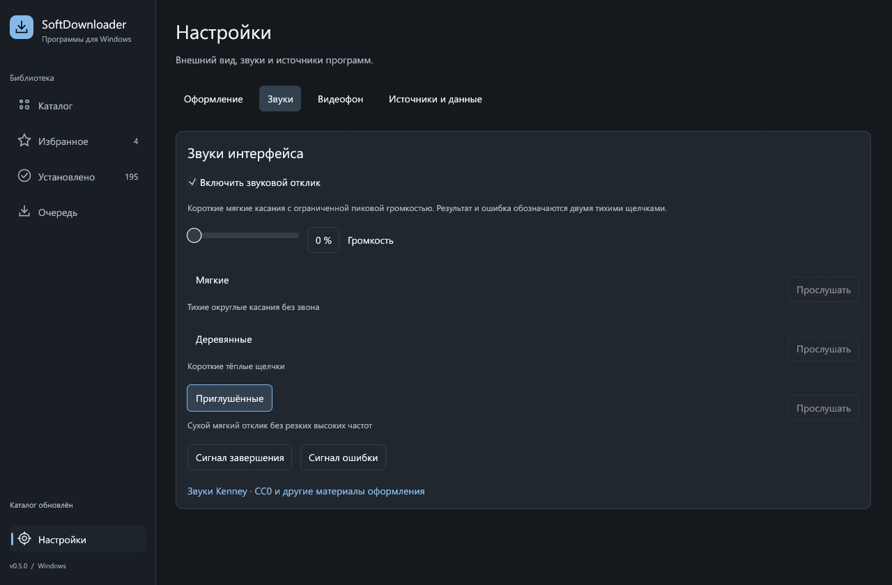
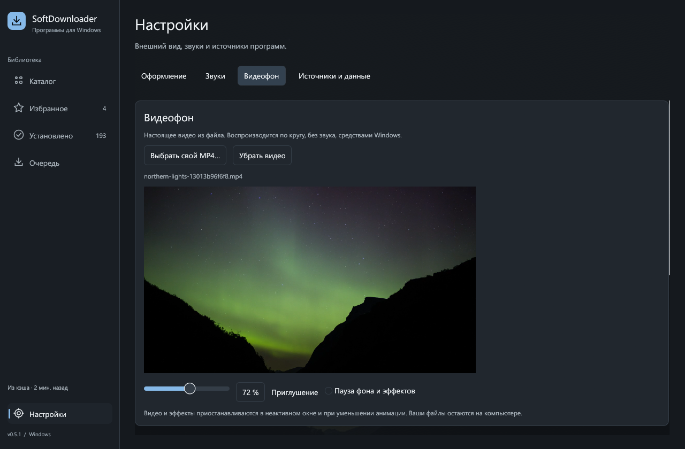
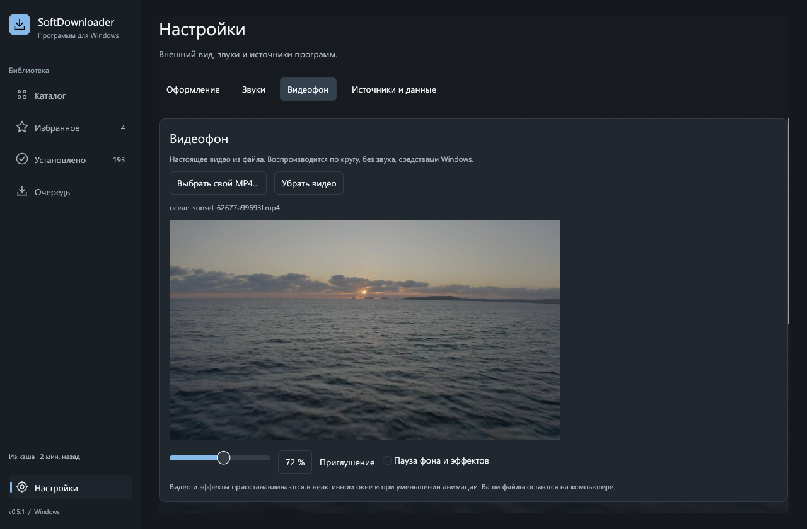

# Оформление, звуки и видеофон

Настройки применяются сразу и сохраняются локально. Кнопка **Настройки** находится внизу левой панели.

## Оформление

Доступны тёмная, светлая, серая и ночная темы. Выберите готовый акцент или задайте свой цвет в палитре. Текст и главное действие автоматически подстраиваются под фон; контраст сохраняется и во время перехода между темами.

В **Праздничном оформлении** можно выбрать:

- **По календарю** — снег в декабре/январе, Хэллоуин в октябре, обычный фон в остальные месяцы. Используется локальная дата Windows.
- **Зима** — мягкие падающие снежинки.
- **Хэллоуин** — тыква с приглушённым свечением.
- **Выключено** — обычное оформление.

Отдельный переключатель **Праздничные эффекты на фоне** отключает графику, сохраняя выбранный режим. **Уменьшить анимацию** применяет темы без перехода и приостанавливает движение фона.

| Зима | Хэллоуин |
|---|---|
|  |  |

## Звуки

Три варианта: **Мягкие**, **Деревянные**, **Приглушённые**. Каждый использует короткие записанные касания с ослабленными высокими частотами и плавными краями. Завершение и ошибка обозначаются двумя негромкими щелчками, без тонального писка.

- Громкость по умолчанию — **18%**. Ползунок управляет уровнем приложения; пиковый уровень дополнительно ограничен и на максимальном значении.
- **Прослушать** воспроизводит выбранный вариант. Кнопки внизу позволяют отдельно послушать завершение и ошибку.
- **Включить звуковой отклик** полностью отключает или включает сигналы. При нулевой громкости воспроизведения нет.
- Ввод текста не сопровождается сигналами. Частые клики объединяются, чтобы звук не превращался в непрерывную очередь.

Клипы — Kenney CC0, обработка и лицензия описаны в [источниках материалов](../assets/CREDITS.md). Идентификаторы старых настроек `glass`, `wood`, `digital` сохранены для совместимости; они теперь выбирают новые тихие записи.

## Видеофон

1. Откройте **Настройки → Видеофон**.
2. Нажмите **Выбрать свой MP4…** либо **Скачать и включить** у готового ролика.
3. Проверьте предпросмотр и настройте **Приглушение**.
4. **Пауза фона и эффектов** останавливает движение. **Убрать видео** возвращает обычный фон.

В приложении есть четыре готовых фона из настоящих видео Mixkit:

| Фон | Длительность | Загрузка |
|---|---|---|
| Снег в хвойном лесу | 10 секунд | 3,9 МиБ |
| Звёзды над Маттерхорном | 4 секунды | 1,6 МиБ |
| Северное сияние | 12 секунд | 3,6 МиБ |
| Закат над морем | 18 секунд | 5,8 МиБ |

Нажмите **Скачать и включить** у понравившегося пейзажа. Ролик загрузится с проверкой размера и SHA-256 и сразу станет фоном. У каждого есть ссылка на источник и лицензию. Во время загрузки доступна отмена. Загруженные файлы лежат в подпапке `backgrounds` папки данных приложения; повторное включение использует проверенный локальный файл.

Свой файл остаётся на прежнем месте: сохраняется только путь. Если переместить или удалить его, выберите его заново. Список переносимых программ не содержит видео и настройки оформления.

Воспроизведение выполняет **Windows Media Foundation**, без звука и внешнего плеера. MP4/H.264 — наиболее совместимый вариант; диалог также позволяет выбрать M4V, MOV и WMV, доступность кодека проверяется при открытии. Пользовательский файл ограничен 512 МиБ; декодирование уменьшает кадр до 1280×720, сохраняя пропорции. В неактивном/свёрнутом окне и при уменьшении анимации видео ставится на паузу.

| Северное сияние | Закат над морем |
|---|---|
|  |  |
